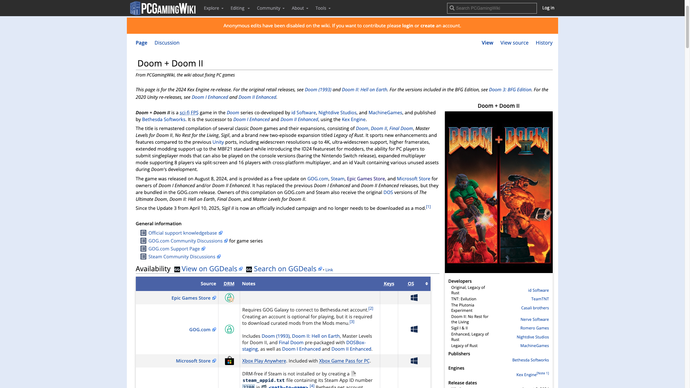
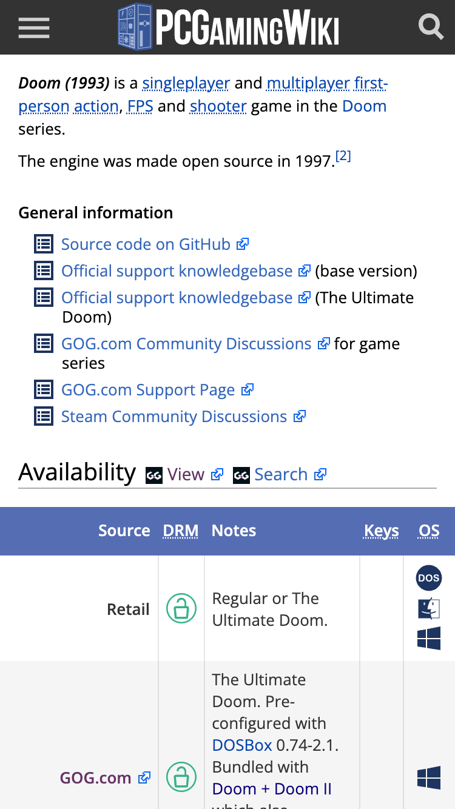

# PCGamingWiki to GGDeals Link Generator

Userscript that adds GG.deals buttons to PCGamingWiki pages. / Userscript que añade botones a GG.deals en las páginas de PCGamingWiki.

*The two buttons hang off the **Availability** heading — the section that already lists where the game is sold. / Los dos botones cuelgan del encabezado **Availability**, la sección que ya lista dónde se vende el juego.*

*On a narrow screen the pair still rides the heading, with the labels cut to **View** and **Search** so the three fit on the line instead of pushing the heading onto its own. / En una pantalla estrecha el par sigue montado en el encabezado, con las etiquetas recortadas a **View** y **Search** para que los tres quepan en el renglón en vez de empujar el encabezado a una línea aparte.*

## English

### What it does

- Adds **two** buttons to **[GG.deals](https://gg.deals/)** on PCGamingWiki articles, so you can check prices for the game you are reading about.
- They sit next to the **Availability** heading, the section that already lists the stores selling the game — so the price comparison lands where you were looking anyway.
- **Why two, and how they differ.** They look identical but do different things, and each says which in its tooltip:
  - **View on GGDeals** builds the store URL directly from the title. It is one click when it works, but the slug is a guess and it can 404.
  - **Search on GGDeals** runs a title search instead. It always returns something, even when the direct guess would have missed.
- **The tooltip is the wiki's own.** It is drawn with PCGamingWiki's ReferenceTooltips styles — same box, same tail, same delay and same fade as the tooltips on the article's references — and it obeys that gadget's settings: turn its tooltips off from the cog and these go quiet too, leaving the plain browser tooltip. It only ever appears on hover; the link's click is never intercepted.
- **The title is normalised the way GG.deals writes its slugs,** which is what makes the direct link work as often as it does: accents are stripped (`Pokémon` → `pokemon`), apostrophes and initialism dots are removed with no gap (`Marvel's Spider-Man` → `marvels-spider-man`, `S.T.A.L.K.E.R. 2` → `stalker-2`), and the rest of the punctuation becomes a separator so `Tomb Raider IV-VI` does not collapse into `IVVI`.
- The GG.deals favicon rides along as the icon; if the wiki's content policy blocks it, the icon quietly removes itself and the button keeps working with just its label.
- Both open in a new tab, with `rel="noopener noreferrer"`, so the destination gets neither `window.opener` nor the referrer.

**Language:** none — both labels and both tooltips are in English, matching the wiki itself.

**Install:**
1. Install a userscript manager: [Violentmonkey](https://violentmonkey.github.io/) (open source, Chrome/Edge/Firefox) or [Tampermonkey](https://www.tampermonkey.net/). On Chrome and Edge, also turn on **Allow user scripts** on the extension's own page in `chrome://extensions` — without it nothing runs.
2. Open the installer: [pcgamingwiki-to-ggdeals.user.js](https://github.com/g31w0fw0rld/pcgamingwiki-to-ggdeals/raw/main/pcgamingwiki-to-ggdeals.user.js) (also on [GreasyFork](https://greasyfork.org/es-419/users/1590477-g31w) and [OpenUserJS](https://openuserjs.org/users/g31w0fw0rldgmail.com/scripts)).

**Site:** `pcgamingwiki.com`

## Español

### Qué hace

- Añade **dos** botones hacia **[GG.deals](https://gg.deals/)** en los artículos de PCGamingWiki, para consultar precios del juego que estás leyendo.
- Van junto al encabezado **Availability**, la sección que ya lista las tiendas donde se vende el juego — así la comparación de precios queda donde ya estabas mirando.
- **Por qué son dos, y en qué se diferencian.** Se ven idénticos pero hacen cosas distintas, y cada uno lo dice en su tooltip:
  - **View on GGDeals** arma la URL de la tienda directamente desde el título. Es un solo clic cuando acierta, pero el slug es una suposición y puede dar 404.
  - **Search on GGDeals** hace en cambio una búsqueda por título. Siempre devuelve algo, incluso cuando la suposición directa habría fallado.
- **El tooltip es el de la propia wiki.** Se dibuja con los estilos de ReferenceTooltips de PCGamingWiki —la misma caja, la misma cola, el mismo retardo y la misma animación que los tooltips de las referencias del artículo— y obedece los ajustes de ese gadget: si apagas sus tooltips desde el engranaje, estos también callan y queda el del navegador. Solo sale al pasar el ratón; el clic del enlace no se intercepta nunca.
- **El título se normaliza igual que GG.deals escribe sus slugs,** que es lo que hace que el enlace directo acierte tan a menudo: se quitan los acentos (`Pokémon` → `pokemon`), los apóstrofos y los puntos de sigla se eliden sin dejar hueco (`Marvel's Spider-Man` → `marvels-spider-man`, `S.T.A.L.K.E.R. 2` → `stalker-2`), y el resto de la puntuación pasa a ser separador para que `Tomb Raider IV-VI` no acabe como `IVVI`.
- El favicon de GG.deals va como icono; si la política de contenido de la wiki lo bloquea, el icono se quita solo y el botón sigue funcionando con su etiqueta.
- Los dos abren en una pestaña nueva, con `rel="noopener noreferrer"`, así que el destino no recibe ni `window.opener` ni el referente.

**Idioma:** ninguno — las dos etiquetas y los dos tooltips están en inglés, igual que la propia wiki.

**Instalación:**
1. Instala un gestor de userscripts: [Violentmonkey](https://violentmonkey.github.io/) (código abierto, Chrome/Edge/Firefox) o [Tampermonkey](https://www.tampermonkey.net/). En Chrome y Edge, activa además **Allow user scripts** en la página de la propia extensión en `chrome://extensions`; sin eso no se ejecuta nada.
2. Abre el instalador: [pcgamingwiki-to-ggdeals.user.js](https://github.com/g31w0fw0rld/pcgamingwiki-to-ggdeals/raw/main/pcgamingwiki-to-ggdeals.user.js) (también en [GreasyFork](https://greasyfork.org/es-419/users/1590477-g31w) y [OpenUserJS](https://openuserjs.org/users/g31w0fw0rldgmail.com/scripts)).

**Sitio:** `pcgamingwiki.com`

## Privacy / Privacidad

**EN:** the script makes no network requests and stores nothing: it only reads the page title (`document.title`) to get the game name and inserts the GG.deals links. It declares `@grant none`, so it has no access to the userscript manager's privileged APIs (storage, cross-origin requests). Nothing is sent to third parties or to the author, and you only visit GG.deals if you click a button.

**ES:** el script no hace ninguna petición de red ni guarda nada: solo lee el título de la página (`document.title`) para sacar el nombre del juego e inserta los enlaces hacia GG.deals. Declara `@grant none`, así que no tiene acceso a las APIs privilegiadas del gestor de userscripts (almacenamiento, peticiones entre dominios). No se envía nada a terceros ni al autor, y solo visitas GG.deals si haces clic en un botón.

## Support / Apoyar

This is part of something I'm building to grow. If it helps you and you'd like to support it, you can tip me on **[Ko-fi](https://ko-fi.com/g31w0fw0rld)** —only if you want—; and if a cause needs it more than I do, help that one instead.

Esto es parte de algo que estoy construyendo para crecer. Si te sirve y quieres apoyar, puedes invitarme un café en **[Ko-fi](https://ko-fi.com/g31w0fw0rld)** —solo si quieres—; y si hay una causa que lo necesite más que yo, ayúdala a ella.

---
Author / Autor: **g31w0fw0rld** · License / Licencia: **MIT**
